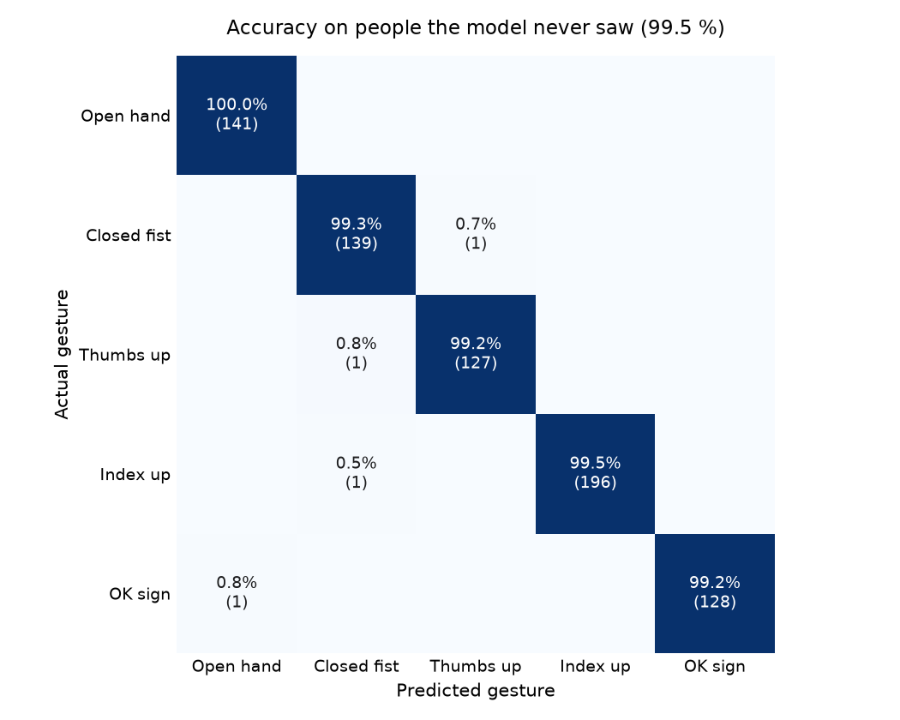

<div align="center">

# GestureFlow

**Your webcam recognizes your hand gestures in real time.**

**5 gestures** · **99.5 % accuracy on people the model never saw** · **runs on a regular laptop webcam**

[](https://www.python.org/)
[](LICENSE)

</div>

---

## What it does

Show your right hand to the webcam. GestureFlow finds the 21 key points of your
hand (fingertips, joints, wrist), works out the shape they form, and tells you which
gesture you are making, live.

| ✋ Open hand | ✊ Closed fist | 👍 Thumbs up | ☝️ Index up | 👌 OK sign |
| :---------: | :-----------: | :----------: | :---------: | :--------: |

It works whatever your hand size, its position in the frame or its angle.

---

## How it works

1. **Detect the hand.** Google's MediaPipe finds the 21 key points of the hand in each video frame.
2. **Standardize it.** The points are rescaled and rotated into the same reference position,
   so a small hand far away and a large hand up close look the same to the model.
   We also measure finger angles and distances.
3. **Recognize the gesture.** A machine learning model (Random Forest) trained on
   our own recordings picks the most likely gesture.

---

## Results

We recorded **735 hand poses** from 4 people. To check that GestureFlow works on
people it has never seen, we trained the model on 3 people and tested it on the 4th,
then repeated for each person.

<div align="center">
  
</div>

Only 4 poses out of 735 were misread. Reproduce it with `uv run gesture-evaluate`.

---

## Try it

Requires a webcam, [uv](https://docs.astral.sh/uv/) and Python 3.12 (uv installs it if needed).

```bash
git clone https://github.com/Laidwin/GestureFlow.git
cd GestureFlow
uv sync
uv run gesture-train      # trains the model on the included recordings, a few seconds
uv run gesture-predict
```

Show your right hand to the camera. Press **Esc** to quit.

---

## The project

GestureFlow was built at **IMT Mines Alès** as part of the *Computer Vision*
specialization module, by a team of four:

- Jules
- Martin
- Matthias
- [William Machecourt](https://github.com/Laidwin)

---

## For developers

<details>
<summary><b>Train your own model or add gestures</b></summary>

<br>

```bash
# 1. Record samples (press Space to save a pose)
uv run gesture-capture --gesture CloseFist --name Alice

# 2. Standardize the recordings
uv run gesture-normalize

# 3. Merge them into one file per gesture
uv run gesture-fuse

# 4. Train the model
uv run gesture-train

# 5. Check it on people it never saw
uv run gesture-evaluate

# 6. Try it live
uv run gesture-predict
```

To see a recorded hand in 3D:

```bash
uv run gesture-visualize data/normalized/CloseFist_William_normalized.json --index 0
```

Every command accepts `--help`. To add a new gesture, follow
[Adding gestures](docs/adding-gestures.md).

</details>

<details>
<summary><b>Technical details</b></summary>

<br>

- **Hand detection:** MediaPipe Hands, 21 landmarks in 3D world coordinates
- **Features:** 78 values per sample (63 normalized coordinates and 15 geometric features)
- **Model:** Random Forest, 200 trees, with feature scaling
- **Evaluation:** leave-one-person-out cross-validation (`gesture-evaluate`)
- **Stack:** Python, MediaPipe, OpenCV, NumPy, scikit-learn

More in the documentation:

- [Normalization algorithm](docs/normalization.md)
- [Data format](docs/data-format.md)
- [Adding gestures](docs/adding-gestures.md)

</details>

<details>
<summary><b>Project structure</b></summary>

<br>

```text
src/hand_gesture/   capture, normalize, fuse, train, evaluate, predict, visualize
data/               raw, normalized and fused recordings
models/             trained model (created by gesture-train)
docs/               documentation
```

</details>

---

<div align="center">
<sub>MIT License · see <a href="LICENSE">LICENSE</a></sub>
</div>
